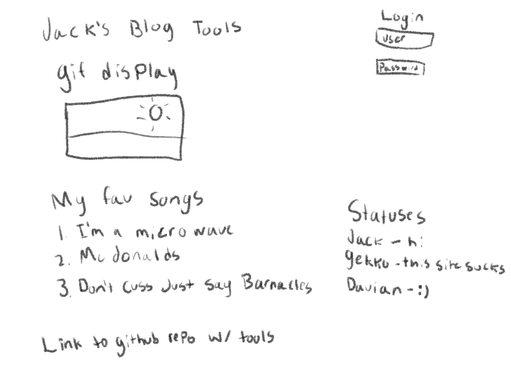

# startup

# Elevator Pitch for Jack's Blog Tools.

I want to build some simple apps that can make customization of small indivdual programs websties easier. The plan is to make a way to update the site without having to edit anything for simple things like a top ten song list or a gif for what the weather is like. I would have to code avalible for download in templates for easy integration into anyones site. I would also like to add statuses for logged in users that will display on the main page when actively logged into the site.

HTML- I am going to use HTML for the structure, I plan on having a login page, a main page that has a my personal settings, a sandbox page where users can use the config page to preview the application.

CSS- I will be using CSS to style the website to make look epic.

JavaScript- For Accounts, to make the user inputs from the config page apply to the display page. Store user statuses. 

Service-
* Login
* Updating User Statuses
* Updating the Display to match config

DB- Store Users, Statuses, and the users config choices for the display page.

Login- Registration, Logins. Users won't be able to display a status or change config without an account.

Websocket- Gather statuses from online users and share them to others on the site.

React- Application ported to use the React web framework.

